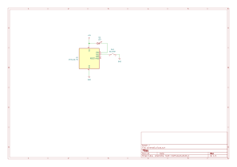

# Button

Exploring on how button works in attiny10. This code does 2 things,

1. Turn on an LED when the button is pressed
2. Keep the LED on when long pressed and released

It's simple, but it is also a simple exploratory project.

## Setup

Here's the schematic below.

